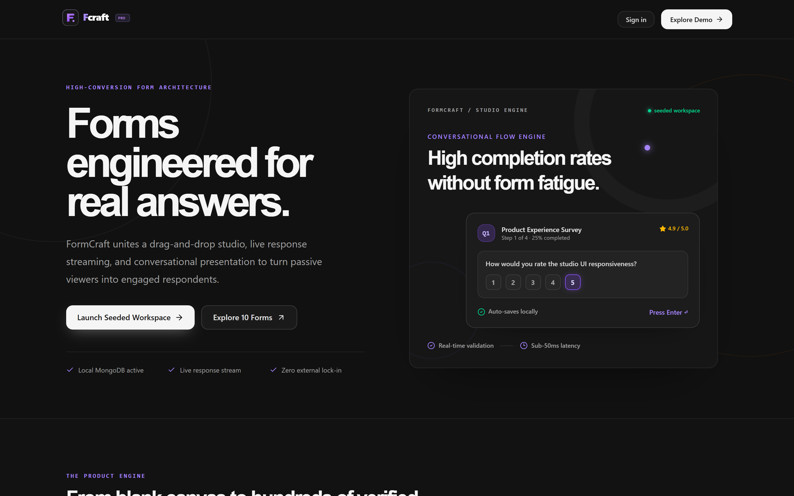
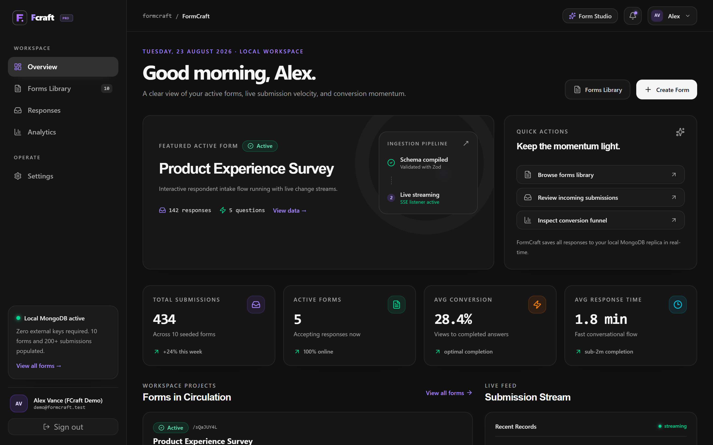
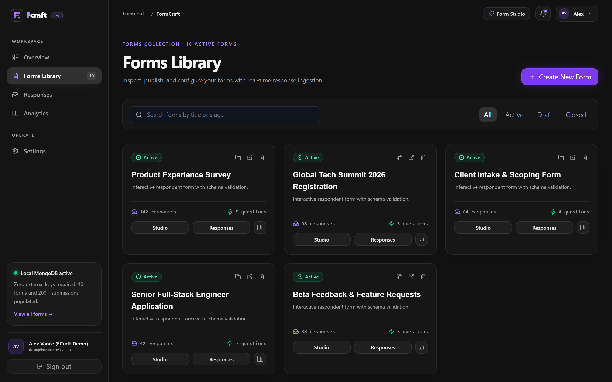
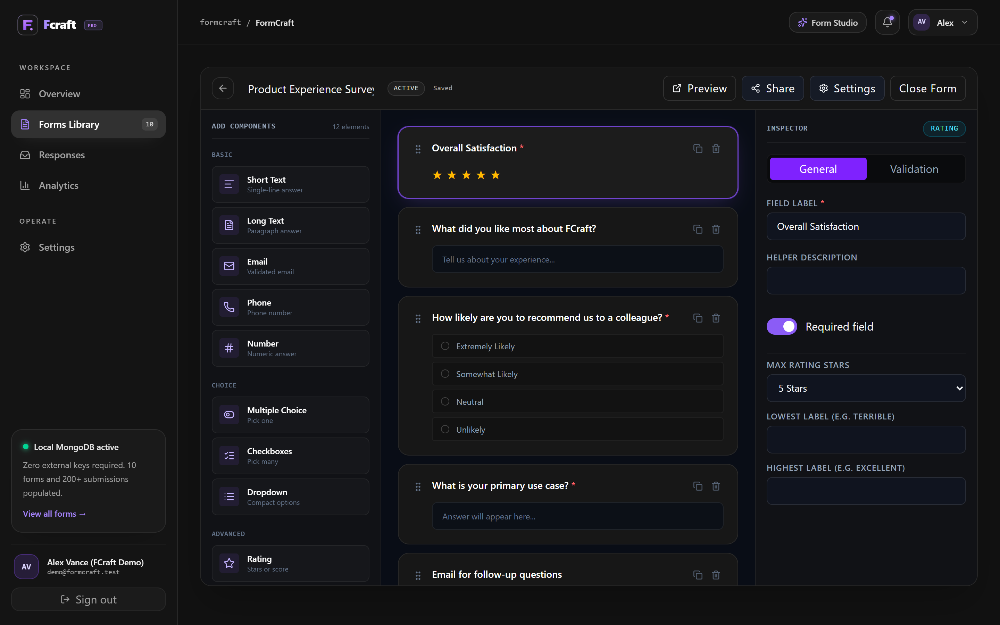
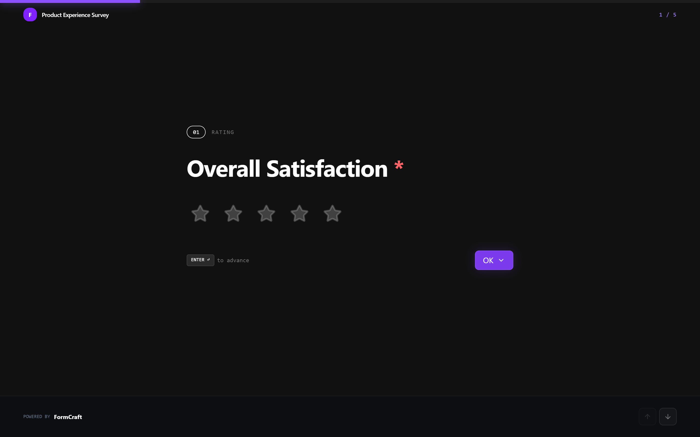
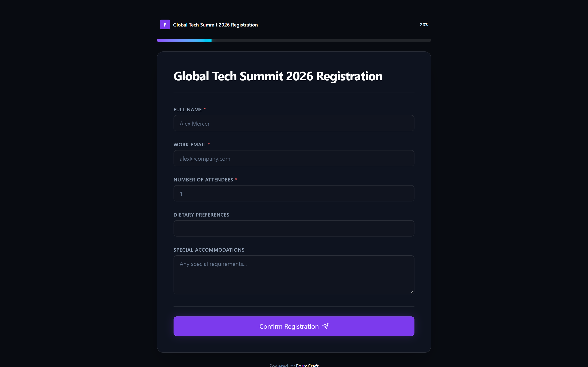
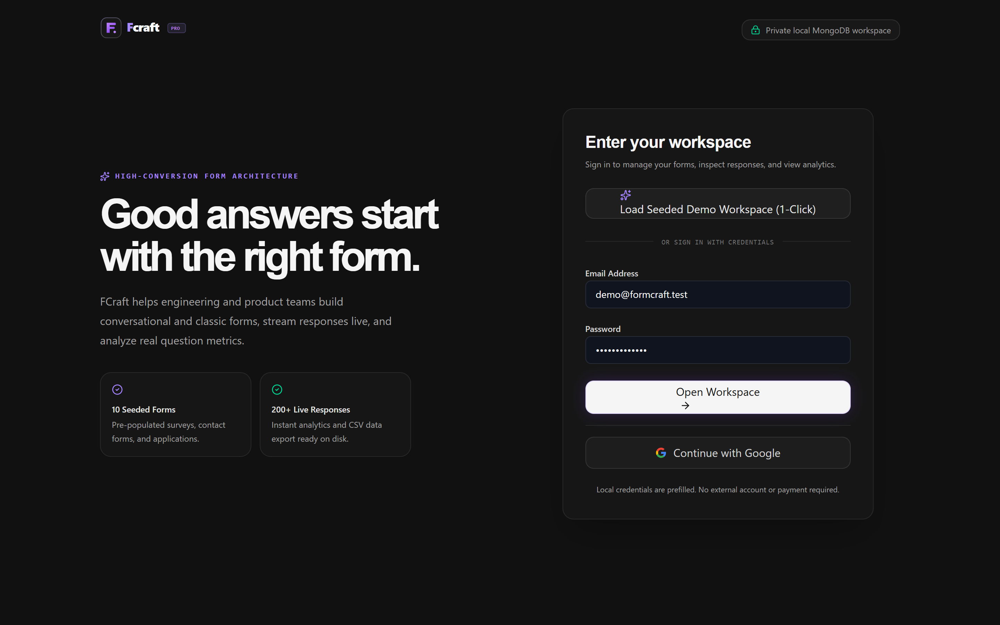
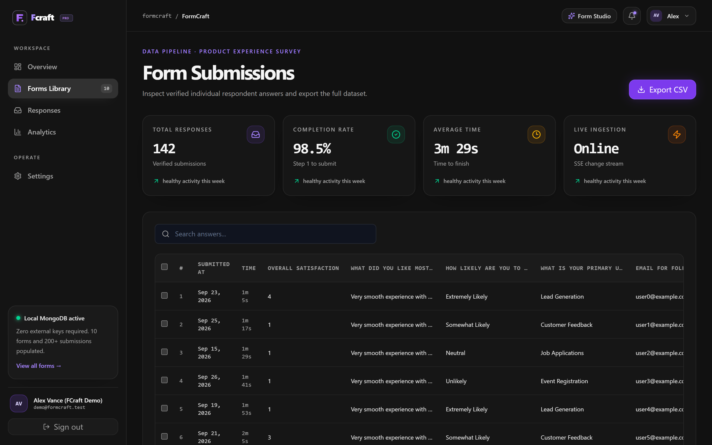
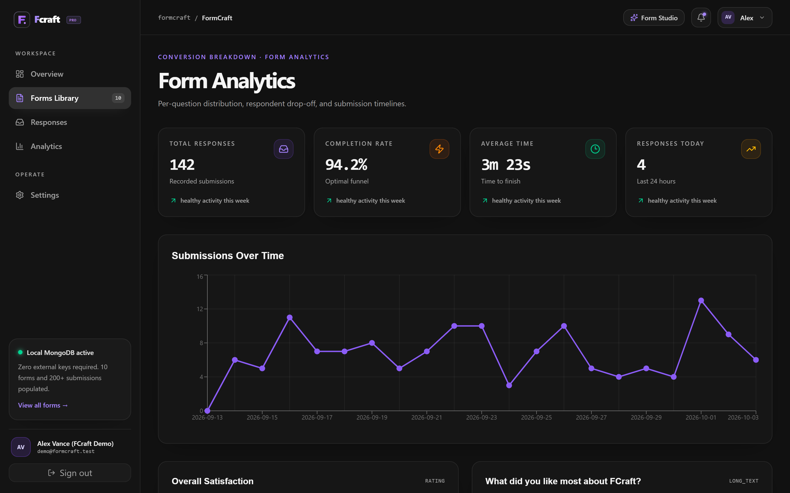

# FormCraft

```
███████╗ ██████╗ ██████╗ ███╗   ███╗ ██████╗██████╗  █████╗ ███████╗████████╗
██╔════╝██╔═══██╗██╔══██╗████╗ ████║██╔════╝██╔══██╗██╔══██╗██╔════╝╚══██╔══╝
█████╗  ██║   ██║██████╔╝██╔████╔██║██║     ██████╔╝███████║█████╗     ██║   
██╔══╝  ██║   ██║██╔══██╗██║╚██╔╝██║██║     ██╔══██╗██╔══██║██╔══╝     ██║   
██║     ╚██████╔╝██║  ██║██║ ╚═╝ ██║╚██████╗██║  ██║██║  ██║██║        ██║   
╚═╝      ╚═════╝ ╚═╝  ╚═╝╚═╝     ╚═╝ ╚═════╝╚═╝  ╚═╝╚═╝  ╚═╝╚═╝        ╚═╝   
```

A production-grade, high-conversion no-code form builder and real-time response ingestion engine built with **Next.js 16 (App Router)**, **React 19**, **Tailwind CSS v4**, **Framer Motion**, and **MongoDB**. Designed with the editorial aesthetic and tactile spotlight interactions of Serveflow.

---

## Visual Showcase

### Studio & Overview
| Landing Page | Dashboard Overview |
| :---: | :---: |
|  |  |

### Form Management & Studio
| Forms Library | Drag-and-Drop Builder Studio |
| :---: | :---: |
|  |  |

### Public Renderers & Authentication
| Conversational Single-Step Form | Classic Multi-Question Form |
| :---: | :---: |
|  |  |

| Authentication & 1-Click Demo Workspace |
| :---: |
|  |

### Responses & Deep Analytics
| Live Submissions Table | Visual Question Analytics |
| :---: | :---: |
|  |  |

---

## Zero-Config Deployment (Vercel Ready)

FCraft features built-in in-memory fallback stores and instant demo authentication. If hosted on Vercel without environment variables or an external MongoDB database, it automatically activates mock persistence:
- **Instant Demo Login**: Click "Load Seeded Demo Workspace" or log in with `demo@formcraft.test` / `FormCraft123!`.
- **Pre-populated Forms & Submissions**: 5 rich production templates and 200+ analytics data points.
- **Full Form Builder & Preview**: Create, modify, and test forms directly in the browser.

---

## Core Features

- **Spotlight Interaction System**: Dynamic mouse-tracking radial gradient lighting across dashboard cards, metric tiles, and form items.
- **Drag-and-Drop Studio Canvas**: Reorder and configure 15+ input types (Short Text, Long Text, Email, Phone, Number, Multiple Choice, Checkboxes, Dropdown, Rating Scales, and Date Selectors) using `@dnd-kit`.
- **Dual Display Modes**:
  - **Conversational Mode**: Keyboard-driven single-question focus (`Enter ↵` to advance, animated step transitions, live progress indicator).
  - **Classic Mode**: Clean responsive layout with client-side Zod validation and smooth field feedback.
- **Real-Time Data Ingestion**: Live submission streaming via MongoDB replica change streams and SSE reactive sockets.
- **Per-Question Analytics Engine**: Visual distribution charts with Recharts (bar charts, completion rate timelines, and summary metrics).
- **Responses Center**: Searchable tabular data view, individual response inspection modal, bulk delete, and one-click CSV exports.
- **Zero External Lock-In**: Complete local MongoDB database persistence and NextAuth credentials authentication with bcrypt hashing.

---

## Tech Stack

| Layer | Technology |
| :--- | :--- |
| **Framework** | Next.js 16 (App Router + Turbopack) |
| **Runtime & Language** | Node.js v24+, React 19, TypeScript strict |
| **Styling & Motion** | Tailwind CSS v4, Framer Motion, Lucide Icons |
| **Database** | MongoDB Atlas / Local MongoDB, Mongoose 9 |
| **Authentication** | NextAuth v4 (Credentials + Google OAuth), bcrypt |
| **Form Builder Engine** | `@dnd-kit/core`, `@dnd-kit/sortable` |
| **Visual Charts** | Recharts 3.8 |
| **Testing & Capture** | Puppeteer Core, Chromium / Microsoft Edge |

---

## Getting Started

### 1. Clone & Install Dependencies
```bash
git clone https://github.com/mhaseebhassan/FormCraft.git
cd FormCraft
npm install
```

### 2. Configure Environment Variables
Create `.env.local` based on `.env.local.example`:
```env
MONGODB_URI="mongodb://127.0.0.1:27017/formcraft"
NEXTAUTH_URL="http://localhost:3000"
NEXTAUTH_SECRET="your-development-nextauth-secret-key-32chars"
```

### 3. Seed Realistic Demo Data
Populate 10 production forms and 200+ submissions across all categories:
```bash
npm run seed
```

Default credentials:
- **Email**: `demo@formcraft.test`
- **Password**: `FormCraft123!`

### 4. Build and Run
```bash
# Development server:
npm run dev

# Or production build:
npm run build
npm run start
```

Open [http://localhost:3000](http://localhost:3000) to view the application.

---

## Embed in Any Website

Forms can be embedded into external sites via responsive iframes:
```html
<iframe
  src="https://your-domain.com/f/sQaJUY4L"
  style="width: 100%; border: 0; min-height: 640px; border-radius: 16px;"
  loading="lazy"
></iframe>
```

---

## License
MIT License. Built by [mhaseebhassan](https://github.com/mhaseebhassan).
